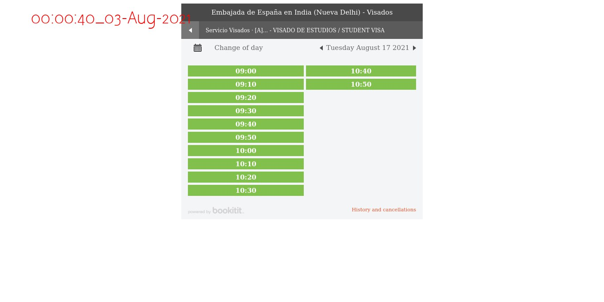
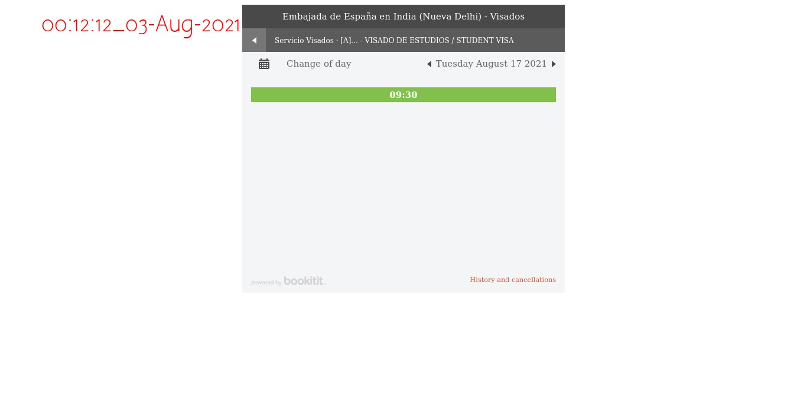

# Spain-Slot-Check

Selenium Based Bot to check for available slots. Supports Telegram Integration.

__Note:__

*Only* checks for slots. Doesn't book for ethical & legal reasons.

```
Run python check.py
```
## Functioning:

1. Opens a browser
2. Accepts T & C
3. Selects visa type.
4. Scans the webpage using OCR.
5. If the text **doesn't** contain `No slots available`, Telegram-Bot sends a message along with screenshot to the group.
6. Closes the browser.
7. Wait randomly for sometime and repeat.

## Working-Screenshots




## Requirements

telegram-send
pytesseract